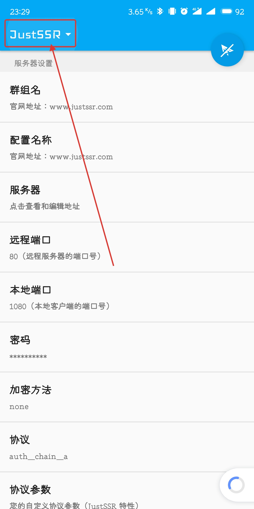
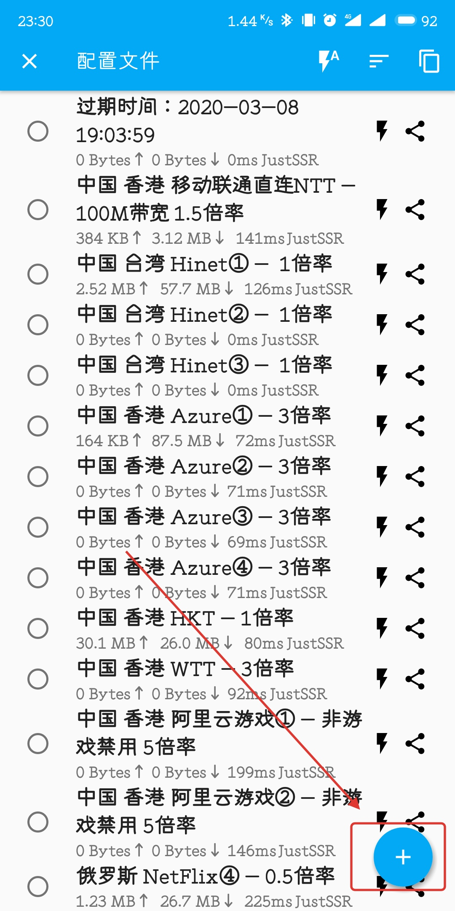
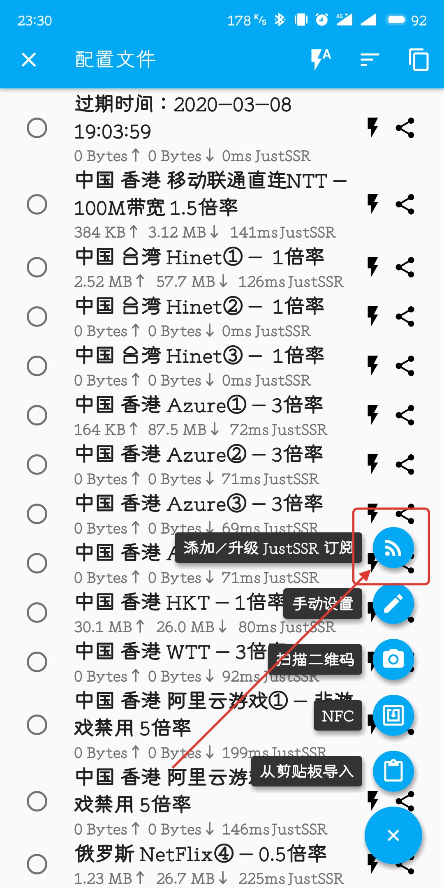
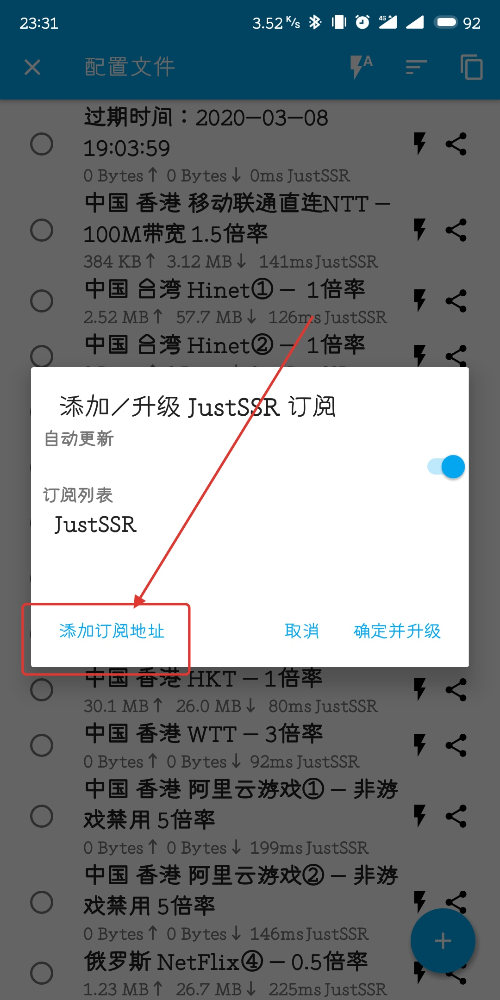
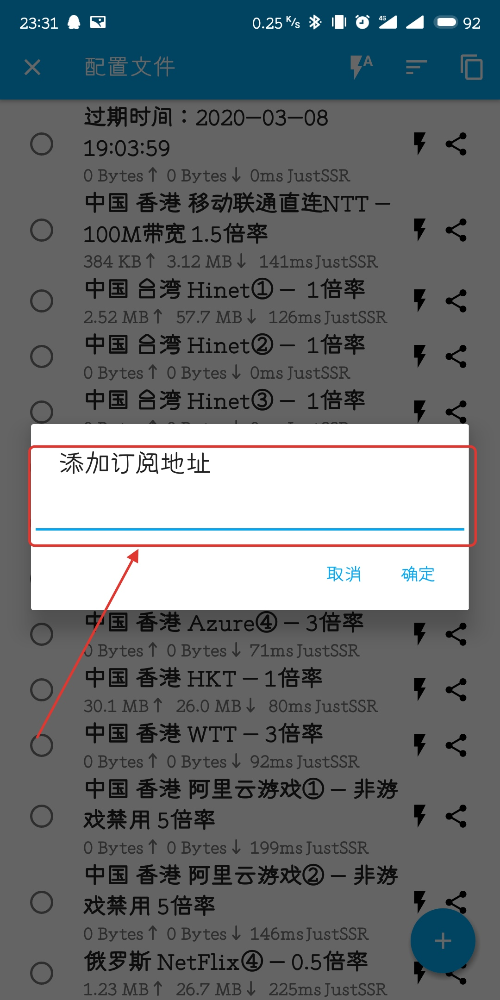
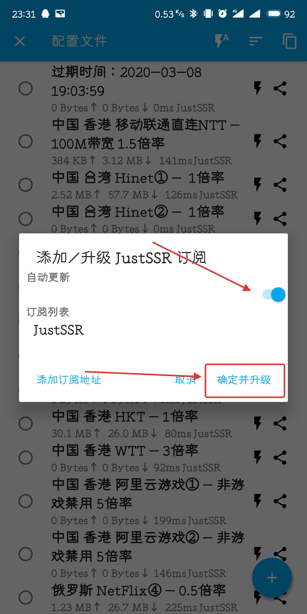

# JustSSR专版SSR

### 下载后打开软件

点击左上方`JustSSR`字母样式，进入配置文件列表，点击右下方加号弹出选项框，选择`添加/升级 JustSSR 订阅` 选项

### 点击添加订阅地址 选项后将网站内得到的订阅连接粘贴在文本框上后点击确定

### 等待识别完毕后，勾选自动更新 选项，点击确定并升级 按钮后等待几秒更新订阅节点后选择节点使用

## **节点列表中有一个计时节点和一个计流量节点请勿选择使用。如果是游戏玩家请将软件首页下方的UDP转发选项打开，否则会造成游戏丢包卡顿甚至掉线。**

## ​ **希望你们能够根据本图文掌握使用方法。**

