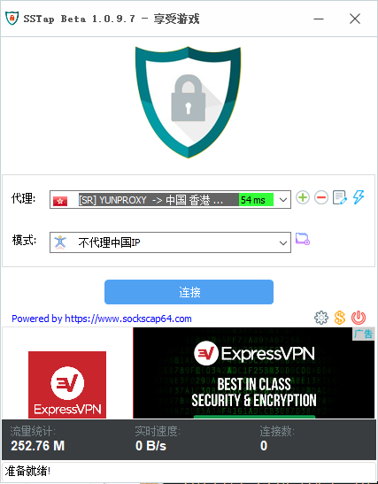

# SSTap

* 系统要求：Windows 7 及以上
* 软件版本：SSTap Beta 1.0.9.3 及以上
* 设备要求：Windows PC / Tablet

> 尽管 SS-Tap 宣称为游戏而生，但 SS / SSR 项目却并非为游戏设计的，其设计结构和很多代码实现都并不能提供足够优秀的游戏性能，JustSSR 仍然建议有游戏加速需求的用户使用专业的游戏加速器。
>
> 此外，如果你有使用 BitTorrent 协议的需求（各类 BT/PT 下载），则应当避免在使用这些软件时开启 SS-Tap，否则 BitTorrent 流量将有极大可能被 SS-Tap 路由通过 JustSSR 网络，而 JustSSR 的条款和条件中明确指出不允许在 JustSSR 网络上使用 BitTorrent 协议，否则将暂时或永久限制订阅或账户访问。 
>
> 作者 Taro 宣称 SS-Tap 的代码没有备份，而储存代码的硬盘因为控制芯片损坏，永久丢失了这些代码，并决定放弃 SS-Tap 的开发，因此，SS-Tap 将可能在未来的系统更新中出现意料之外的问题或无法使用。

## 安装软件

### 打开软件根据图片提示点击`齿轮 - SSR订阅 - SSR订阅管理` 

### 进入`SSR订阅管理`页面，将得到的`订阅链接`粘贴至输入框并点击`添加。`然后点击右上角的 X 关闭并等待更新节点

### 更新完节点会返回软件主界面，继续点击`齿轮 - 设置` 打开软件设置界面

### 设置选项中将`预选DNS`更改为`谷歌DNS`或者`其他DNS（不推荐国内DNS）`

### 以上准备工作都完成后，回`主界面`选择节点，模式选择`不代理中国IP`点击 `连接` 开始使用

### 

